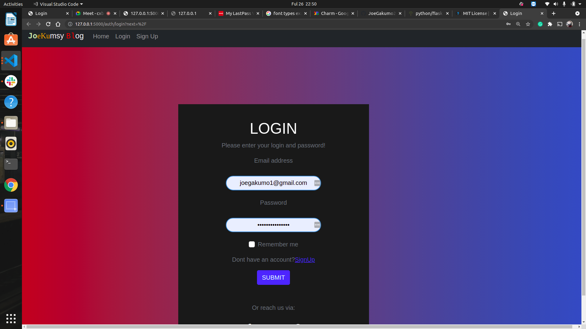
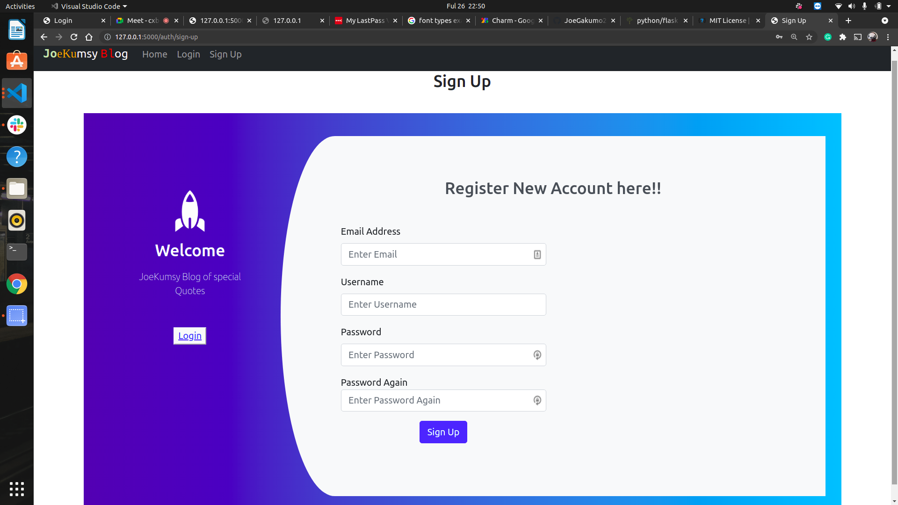
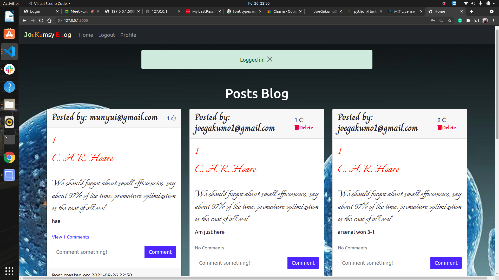
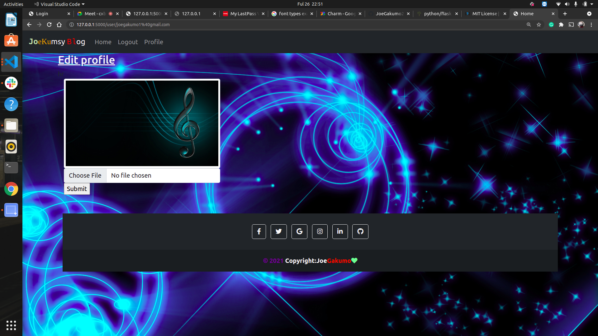
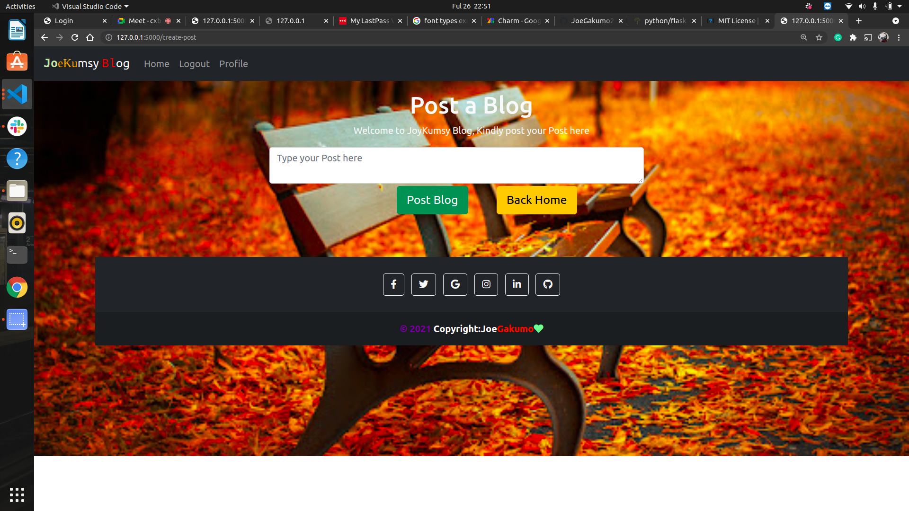

# My Personal  Blog
#### This application was created and designed by <a href="#">Joseph Gakumo Munyui</a> a student at <a href="#">Moringa school</a> doing Fullstack Dev
___
## Description
* This is a personal blogging website where you can create and share your opinions and other users can read and comment on them. Additionally, add it has a  feature that displays random quotes to inspire your users.

___
Setup requirements
* Git
* Web_browser
* Flask (1.1.2)
* pip
* Python 3.8
* sqlalchem db
### Setup Installation
*Copy the github repository url
* Clone to your computer
* Open terminal and navigate to the directory of 
* the project you just cloned to your computer
* Run the following command to  start the server <a href="#">* * using virtual environment</a>
* python3.8 -m venv --without-pip virtual
* source virtual/bin/activate curl https://bootstrap.pypa.io/get-pip.py | python
* pip install --force-reinstall flask==1.1.2
* chmod a+x start.sh
--- 
## Technology used
- HTML
- CSS
- Bootstrap
- Python
- Flask
- markdown2
---
## live link
Click to visit <a href="https://joepersonalblog.herokuapp.com/">My personal Blog</a>
---
###  Licence
<a href="https://choosealicense.com/licenses/mit/">MIT Licence</a>
 

Copyright &copy; 2021 Joseph Gakumo Munyui

Permission is hereby granted, free of charge, to any person obtaining a copy
of this software and associated documentation files (the "Software"), to deal
in the Software without restriction, including without limitation the rights
to use, copy, modify, merge, publish, distribute, sublicense, and/or sell
copies of the Software, and to permit persons to whom the Software is
furnished to do so, subject to the following conditions:

The above copyright notice and this permission notice shall be included in all
copies or substantial portions of the Software.

THE SOFTWARE IS PROVIDED "AS IS", WITHOUT WARRANTY OF ANY KIND, EXPRESS OR
IMPLIED, INCLUDING BUT NOT LIMITED TO THE WARRANTIES OF MERCHANTABILITY,
FITNESS FOR A PARTICULAR PURPOSE AND NONINFRINGEMENT. IN NO EVENT SHALL THE
AUTHORS OR COPYRIGHT HOLDERS BE LIABLE FOR ANY CLAIM, DAMAGES OR OTHER
LIABILITY, WHETHER IN AN ACTION OF CONTRACT, TORT OR OTHERWISE, ARISING FROM,
OUT OF OR IN CONNECTION WITH THE SOFTWARE OR THE USE OR OTHER DEALINGS IN THE
SOFTWARE.

  &copy; 2021 JoeKumsy
# Screenshot

